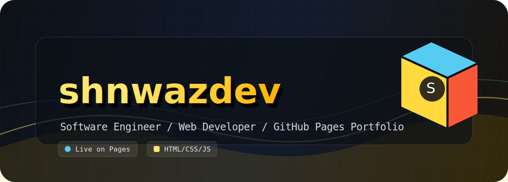

<p align="center">
  
</p>

# shnwazdeveloper.github.io

Modern portfolio website for **shnwazdev**, hosted at the root GitHub Pages URL.

<p>
  <a href="https://shnwazdeveloper.github.io/">
    
  </a>
  <a href="https://github.com/shnwazdeveloper/shnwazdeveloper.github.io">
    
  </a>
  
</p>

## Live Website

https://shnwazdeveloper.github.io/

## Project Snapshot

| Area | Details |
| --- | --- |
| Type | Personal portfolio website |
| Host | GitHub Pages user site |
| Main URL | `https://shnwazdeveloper.github.io/` |
| Stack | HTML, CSS, JavaScript, Leaflet |
| Pages source | `main` branch, repository root |
| Custom domain | None |

## Experience

The website includes a portfolio landing page, profile/about sections, skills, projects, timeline, contact links, interactive visuals, and a terminal-style page for a more developer-focused presentation.

## Tech Stack

```text
HTML5        Structure and content
CSS3         Neo-brutalist visual system and responsive layout
JavaScript   Interactions, terminal effects, dynamic behavior
Leaflet      Map integration
GitHub Pages Static hosting
```

## Repository Map

```text
.
|-- index.html       Main portfolio page
|-- neo-styles.css   Primary design system and layout
|-- script.js        Interactive behavior
|-- terminal.html    Terminal-style portfolio view
|-- image/           Static assets and README banner
|-- robots.txt       Crawler rules
|-- sitemap.xml      Live-site sitemap
`-- LICENSE          Project license
```

## Run Locally

Open `index.html` directly in a browser, or run a small local server:

```powershell
python -m http.server 8000
```

Then open:

```text
http://localhost:8000
```

## Deployment

This is a GitHub Pages user site. Every push to `main` updates:

```text
https://shnwazdeveloper.github.io/
```

## License

This project is licensed under the terms in [LICENSE](LICENSE).
